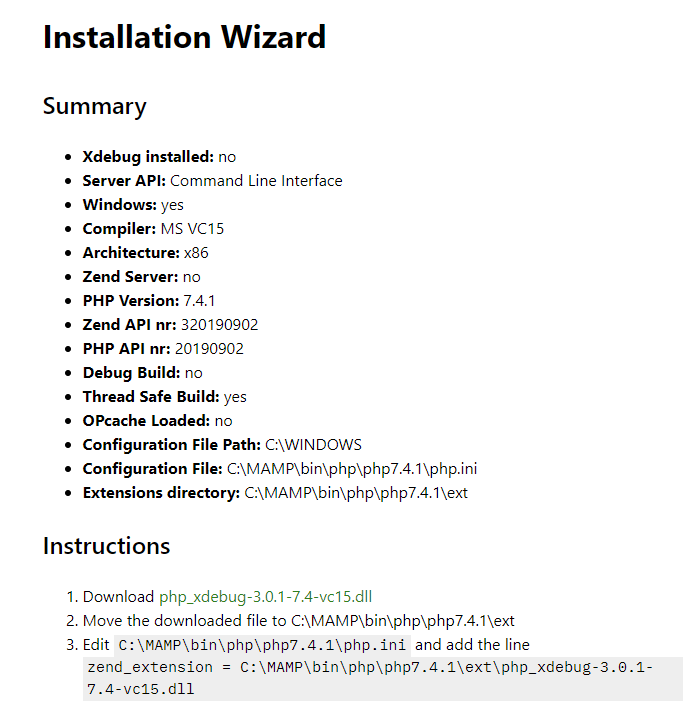

# PHP MYSQL

**[La bible PHP sur https://www.php.net/manual/fr](https://www.php.net/manual/fr)**

<!-- TOC -->

- [PHP MYSQL](#php-mysql)
- [Faites vos premiers pas en PHP](#faites-vos-premiers-pas-en-php)
    - [Decouvrez le fonctionnement d'un site ecrit en PHP](#decouvrez-le-fonctionnement-dun-site-ecrit-en-php)
    - [Preparez votre environnement de travail](#preparez-votre-environnement-de-travail)
    - [Ecrivez votre premier script](#ecrivez-votre-premier-script)
    - [Configurez PHP pour visualiser les erreurs](#configurez-php-pour-visualiser-les-erreurs)
- [Les bases de PHP](#les-bases-de-php)
    - [Les variables](#les-variables)
    - [Les conditions](#les-conditions)
    - [Les boucles](#les-boucles)
    - [Les tableaux](#les-tableaux)
    - [Les fonctions](#les-fonctions)
    - [Inclure des portions de page](#inclure-des-portions-de-page)
- [Transmettez des donnees de page en page](#transmettez-des-donnees-de-page-en-page)
    - [Transmettez des donnees avec l'URL](#transmettez-des-donnees-avec-lurl)
    - [Transmettez des donnees avec les formulaires](#transmettez-des-donnees-avec-les-formulaires)

<!-- /TOC -->

# Faites vos premiers pas en PHP

## Decouvrez le fonctionnement d'un site ecrit en PHP

- Il existe deux types de sites web :
  - les sites statiques : realises en HTML et CSS, leur contenu ne peut etre mis a jour que par le webmaster ;
  - les sites dynamiques : realises avec d'autres outils comme PHP et MySQL en plus de HTML et CSS, ils permettent aux visiteurs de participer a la vie du site, de poster des messages… bref, de rendre le site vivant !
- Les visiteurs du site sont appeles les clients. Ils demandent au serveur qui heberge le site de leur transmettre les pages web.
- PHP est un langage execute par le serveur. Il permet de personnaliser la page en fonction du visiteur, de traiter ses messages, d'effectuer des calculs, etc. Il genere une page HTML.
- MySQL est un systeme de gestion de bases de donnees. Il se charge du stockage des informations (liste des messages, des membres…).

## Preparez votre environnement de travail

- Pour creer des sites web dynamiques, nous devons installer des outils qui transformeront notre ordinateur en serveur, afin de pouvoir tester notre site.
- Les principaux outils dont nous avons besoin sont :
  - Apache, le serveur web ;
  - PHP, le programme qui permet au serveur web d'executer des pages PHP ;
  - MySQL, le logiciel de gestion de bases de donnees.
- Bien qu'il soit possible d'installer ces outils separement, il est plus simple pour nous d'installer un paquetage tout prêt : MAMP sous Windows et Mac OS X, ou XAMPP sous Linux.
- Il est conseille d'utiliser un editeur de texte qui colore le code source, comme Sublime Text ou Atom, pour programmer convenablement en PHP.
  Pour les personnes plus experimentees qui travaillent sur de gros projets, je recommande PHPStorm ou Visual Studio Code.

[live coding de l'installation de XDebug](https://nouvelle-techno.fr/actualites/live-coding-installation-configuration-et-utilisation-de-xdebug-dans-visual-studio-code)

[Debugging a PHP project on VSCode with Xdebug](https://dev.to/zeegcl/debugging-a-php-project-on-vscode-with-xdebug-2anp)

_Mode operatoire installation xDebug_

1. Telecharger MAMP
2. Ajouter a vos variables d'environnement le path de votre php (ex:C:\MAMP\bin\php\php7.4.1)
3. Creer un fichier php.ini en faisant un copier /coller de l'un des fichiers present dans le repectoire C:\MAMP\bin\php\php7.4.1 (suivant la version php selectionner) php.ini-development ou production et le nommer php.ini.
4. Editer le fichier php.ini et y indiquer l'extensions directory (exemple : extension_dir = "C:\MAMP\bin\php\php7.4.1\ext")
5. Tapper dans votre terminal `php-i`, puis copier/ coller le resultat de votre php.ini() dans le [wizard installation de xDebug](https://xdebug.org/wizard) de PHP Version jusqu'a la fin de script.
   
6. Suivre les instructions.
7. Ajouter au fichier php.init les lignes suivantes :

```php.ini
[XDebug]
xdebug.remote_enable = 1
xdebug.remote_autostart = 1
```

> Bug fix There is already a debug configuration "Listen for XDebug" running. ???????????

## Ecrivez votre premier script

- Les pages web contenant du PHP ont l'extension .php.
- Une page PHP est en fait une simple page HTML qui contient des instructions en langage PHP.
- Les instructions PHP sont placees dans une balise ouvrante et fermante : <?php ?>.
- Pour afficher du texte en PHP, on utilise l'instruction echo.
- Il est possible d'ajouter des commentaires en PHP pour decrire le fonctionnement du code. On utilise pour cela les symboles // ou /\* \*/.

## Configurez PHP pour visualiser les erreurs

- Dans le fichier php.ini du dossier C:\MAMP\conf\php7.4.1\php.ini (voir phpinfo() Loaded Configuration File). Attribuer la valeur on au parametre display_errors (`display_errors=on`).

# Les bases de PHP

## Les variables

- Une variable est une petite information qui reste stockee en memoire le temps de la generation de la page PHP. Elle a un nom et une valeur.
- Il existe plusieurs types de variables qui permettent de stocker differents types d'informations : du texte (string), des nombres entiers (int), des nombres decimaux (float), des booleens pour stocker vrai ou faux (bool), etc.
- En PHP, un nom de variable commence par le symbole dollar : `$age` par exemple.
- La valeur d'une variable peut être affichee avec l'instruction echo.
- Il est possible de faire des calculs mathematiques entre plusieurs variables : addition, soustraction, multiplication…

> **La concatenation avec les simple guillemets est plus rapide que les double .Il faut ajouter un . entre chaque terme. Si besoin d'echapper un caractere il faut utiliser l'antislash \ .**

## Les conditions

- Les conditions permettent a PHP de prendre des decisions en fonction de la valeur des variables.
- La forme de condition la plus courante est if ... elseif ... else qui signifie « si »… « sinon si »… « sinon ».

**Exemple else elseif else**

```php
<?php
$autorisation_entrer = "Oui";
if ($autorisation_entrer == "Oui") // SI on a l'autorisation d'entrer
{
    // instructions à exécuter quand on est autorisé à entrer
}
elseif ($autorisation_entrer == "Non") // SINON SI on n'a pas l'autorisation d'entrer
{
    // instructions à exécuter quand on n'est pas autorisé à entrer
}
else // SINON (la variable ne contient ni Oui ni Non, on ne peut pas agir)
{
    echo "Euh, je ne connais pas ton âge, tu peux me le rappeler s'il te plaît ?";
}
?>
```

- On peut combiner des conditions avec les mots-cles AND (« et ») et OR (« ou »).
- Si une condition comporte de nombreux elseif, il peut être plus pratique d'utiliser switch, une autre forme de condition.

**Exemple switch case**

```php
<?php
$note = 10;

switch ($note) // on indique sur quelle variable on travaille
{
    case 0: // dans le cas où $note vaut 0
        echo "Tu es vraiment un gros nul !!!";
    break;

    case 5: // dans le cas où $note vaut 5
        echo "Tu es tres mauvais";
    break;

    case 7: // dans le cas où $note vaut 7
        echo "Tu es mauvais";
    break;

    case 10: // etc. etc.
        echo "Tu as pile poil la moyenne, c'est un peu juste…";
    break;

    case 12:
        echo "Tu es assez bon";
    break;

    case 16:
        echo "Tu te débrouilles tres bien !";
    break;

    case 20:
        echo "Excellent travail, c'est parfait !";
    break;

    default:
        echo "Désolé, je n'ai pas de message à afficher pour cette note";
}
?>
```

- Les ternaires sont des conditions condensees qui font un test sur une variable, et en fonction des resultats de ce test donnent une valeur a une autre variable. Elles sont cependant plus rarement utilisees.

**Exemple ternaire**

```php
<?php
$age = 24;

$majeur = ($age >= 18) ? true : false;
?>
```

## Les boucles

- Les boucles demandent a PHP de repeter des instructions plusieurs fois.
- Les deux principaux types de boucles sont :
  - while : : a utiliser de preference lorsqu'on ne sait pas par avance combien de fois la boucle doit être repetee;
  - for : a utiliser lorsqu'on veut repeter des instructions un nombre precis de fois.
- L'incrementation est une technique qui consiste a ajouter 1 a la valeur d'une variable. La decrementation retire au contraire 1 a cette variable. On trouve souvent des incrementations au sein de boucles for.

**Exemple boucle while**

```php
<?php
$nombre_de_lignes = 1;

while ($nombre_de_lignes <= 100)
{
    echo 'Je ne dois pas regarder les mouches voler quand j\'apprends le PHP.<br />';
    $nombre_de_lignes++; // $nombre_de_lignes = $nombre_de_lignes + 1
}
?>
```

**Exemple boucle do-while**

```php
<?php
$i = 0;
do {
    echo $i;
} while ($i > 0);
?>
```

**Exemple boucle for**

```php
<?php
/* exemple 1 */

for ($i = 1; $i <= 10; $i++) {
    echo $i;
}

/* exemple 2 */

for ($i = 1; ; $i++) {
    if ($i > 10) {
        break;
    }
    echo $i;
}

/* exemple 3 */

$i = 1;
for (; ; ) {
    if ($i > 10) {
        break;
    }
    echo $i;
    $i++;
}

/* exemple 4 */

for ($i = 1, $j = 0; $i <= 10; $j += $i, print $i, $i++);
?>
```

**Exemple boucle foreach**

```php
<?php
$arr = array(1, 2, 3, 4);
foreach ($arr as &$value) {
    $value = $value * 2;
}
// $arr vaut maintenant array(2, 4, 6, 8)
unset($value); // Détruit la référence sur le dernier élément
?>
```

**Exemple boucle foreach sans unset A EVITER sinon genere le rendu ci-dessous**

_Remarques: Vous pouvez modifier facilement les elements d'un tableau en precedent $value d'un &. Ceci assignera une reference au lieu de copier la valeur._

```php
<?php
$arr = array(1, 2, 3, 4);
foreach ($arr as &$value) {
    $value = $value * 2;
}
// $arr est maintenant array(2, 4, 6, 8)

// sans un unset($value), $value est toujours une référence au dernier élément: $arr[3]

foreach ($arr as $key => $value) {
    // $arr[3] sera mis à jour avec chaque valeur de $arr...
    echo "{$key} => {$value} ";
    print_r($arr);
}
// ...jusqu'à ce que finalement la valeur de deuxieme à derniere soit copiée sur la derniere valeur

// sortie :
// 0 => 2 Array ( [0] => 2, [1] => 4, [2] => 6, [3] => 2 )
// 1 => 4 Array ( [0] => 2, [1] => 4, [2] => 6, [3] => 4 )
// 2 => 6 Array ( [0] => 2, [1] => 4, [2] => 6, [3] => 6 )
// 3 => 6 Array ( [0] => 2, [1] => 4, [2] => 6, [3] => 6 )
?>
```

## Les tableaux

- Les tableaux (ou arrays) sont des variables representees sous forme de tableau. Elles peuvent donc stocker de grandes quantites d'informations.
- Chaque ligne d'un tableau possede une cle (qui permet de l'identifier) et une valeur.
- Il existe deux types de tableaux :
  - les tableaux numerotes : chaque ligne est identifiee par une cle numerotee. La numerotation commence a partir de 0;
  - les tableaux associatifs : chaque ligne est identifiee par une courte chaine de texte.
- Pour parcourir un tableau, on peut utiliser la boucle for que l'on connait deja, mais aussi la boucle foreach qui est dediee aux tableaux.
- Il existe de nombreuses fonctions permettant de travailler sur des tableaux, et notamment d'effectuer des recherches.
  - array_key_exists : pour verifier si une cle existe dans l'array;
  - in_array : pour verifier si une valeur existe dans l'array ;
  - array_search : pour recuperer la cle d'une valeur dans l'array.

**Exemple tableau numerote**

```php
<?php
// La fonction array permet de créer un array
$prenoms = array ('François', 'Michel', 'Nicole', 'Véronique', 'Benoît');

// Autres facons de faire
$prenoms[0] = 'François';
$prenoms[1] = 'Michel';
$prenoms[2] = 'Nicole';

// Ou alors
$prenoms[] = 'François'; // Créera $prenoms[0]
$prenoms[] = 'Michel'; // Créera $prenoms[1]
$prenoms[] = 'Nicole'; // Créera $prenoms[2]

// Affiche le 1er element
echo $prenom[0];
?>
```

**Exemple de tableaux associatifs**

```php
<?php
// On crée notre array $coordonnees
$coordonnees = array (
    'prenom' => 'François',
    'nom' => 'Dupont',
    'adresse' => '3 Rue du Paradis',
    'ville' => 'Marseille');

// Ou alors
$coordonnees['prenom'] = 'François';
$coordonnees['nom'] = 'Dupont';
$coordonnees['adresse'] = '3 Rue du Paradis';
$coordonnees['ville'] = 'Marseille';

// Affiche le l'element avec la cle ville
echo $coordonnees['ville'];

// Boucle pour recuperer la cle et la valeur a l'aide de boucle for
$coordonnees = array (
    'prenom' => 'François',
    'nom' => 'Dupont',
    'adresse' => '3 Rue du Paradis',
    'ville' => 'Marseille');

foreach($coordonnees as $cle => $element)
{
    echo '[' . $cle . '] vaut ' . $element . '<br />';
}

// technique d'affichage du tableau avec print_r
$coordonnees = array (
    'prenom' => 'François',
    'nom' => 'Dupont',
    'adresse' => '3 Rue du Paradis',
    'ville' => 'Marseille');

echo '<pre>';
print_r($coordonnees);
echo '</pre>';
?>
```

**Exemple de recherche d'element dans un tableau**

```php
<?php
// AVEC array_key_exists
$coordonnees = array (
    'prenom' => 'François',
    'nom' => 'Dupont',
    'adresse' => '3 Rue du Paradis',
    'ville' => 'Marseille');

if (array_key_exists('nom', $coordonnees))
{
    echo 'La clé "nom" se trouve dans les coordonnées !';
}

if (array_key_exists('pays', $coordonnees))
{
    echo 'La clé "pays" se trouve dans les coordonnées !';
}

// Avec in_array
$fruits = array ('Banane', 'Pomme', 'Poire', 'Cerise', 'Fraise', 'Framboise');

if (in_array('Myrtille', $fruits))
{
    echo 'La valeur "Myrtille" se trouve dans les fruits !';
}

if (in_array('Cerise', $fruits))
{
    echo 'La valeur "Cerise" se trouve dans les fruits !';
}

// Avec array_search
$fruits2 = array ('Banane', 'Pomme', 'Poire', 'Cerise', 'Fraise', 'Framboise');

$position = array_search('Fraise', $fruits2);
echo '"Fraise" se trouve en position ' . $position . '<br />';

$position = array_search('Banane', $fruits2);
echo '"Banane" se trouve en position ' . $position;
?>
```

## Les fonctions

- Les fonctions sont des blocs de code qui executent des instructions en fonction de certains parametres.
- Les fonctions ont generalement une entree et une sortie. Par exemple, si on donne la valeur 4 a la fonction de calcul du cube, celle-ci renvoie 64 en sortie.
- PHP propose des centaines et des centaines de fonctions pretes a l'emploi pour tous types de taches : envoyer un e-mail, recuperer l'heure, crypter des mots de passe, etc.
- Si PHP ne propose pas la fonction dont on a besoin, il est possible de la creer avec le mot-cle function.

**Exemples de fonction native a PHP**

- strlen : longueur d'une chaine
- str_replace : rechercher et remplacer
- str_shuffle : melanger les lettres
- strtolower : ecrire en minuscules
- strtoupper : ecrire en majuscules

## Inclure des portions de page

- Une page PHP peut inclure une autre page (ou un morceau de page) grace a l'instruction include.
- L'instruction include sera remplacee par le contenu de la page demandee.
- Cette technique, tres simple a mettre en place, permet par exemple de placer les menus de son site dans un fichier menus.php que l'on inclura dans toutes les pages. Cela permet de centraliser le code des menus, alors qu'on etait auparavant obliges de le copier dans chaque page sur nos sites statiques en HTML et CSS !

**Syntaxe**

```php
<?php 
include("file.php"); 
?>
```

# Transmettez des donnees de page en page
## Transmettez des donnees avec l'URL

* Une URL represente l'adresse d'une page web (commençant generalement par http://).
* Lorsqu'on fait un lien vers une page, il est possible d'ajouter des parametres sous la forme `bonjour.php?nom=Dupont&prenom=Jean`, qui seront transmis a la page.
* La page `bonjour.php`, dans l'exemple precedent, recevra ces parametres dans un array nomme `$_GET`:
    * `$_GET['nom']`  aura pour valeur « Dupont » ;
    * `$_GET['prenom']`  aura pour valeur « Jean ».
* Cette technique est tres pratique pour transmettre des valeurs a une page, mais il faut prendre garde au fait que le visiteur peut les modifier tres facilement. Il ne faut donc pas faire aveuglement confiance a ces informations, et tester prudemment leur valeur avant de les utiliser.
* La fonction `isset()` permet de verifier si une variable est definie ou non.
* Le transtypage est une technique qui permet de convertir une variable dans le type de donnee souhaite. Cela permet de s'assurer par exemple qu'une variable est bien un `int` (nombre entier).

**Remarques**
* Le `&`  dans le code a ete remplace par `&amp;` dans le lien. Ça n'a rien à voir avec PHP: simplement, en HTML, on demande a ce que les `&` soient ecrits `&amp;` dans le code source. Si vous ne le faites pas, *le code ne passera pas la validation W3C*.

## Transmettez des donnees avec les formulaires
